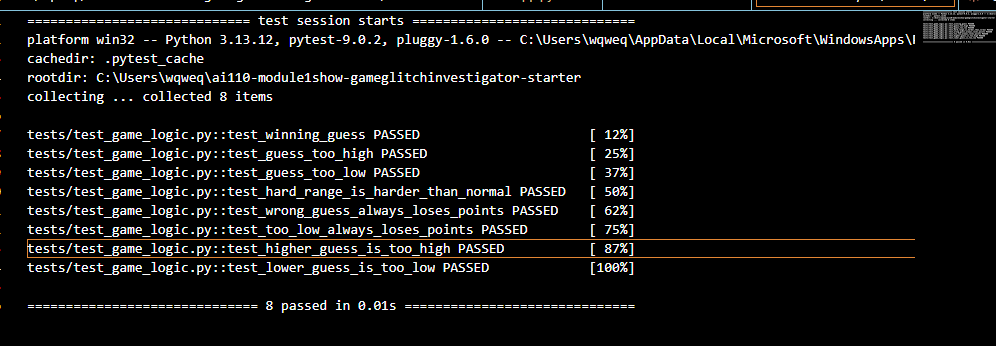

# 🎮 Game Glitch Investigator: The Impossible Guesser

## 🚨 The Situation

You asked an AI to build a simple "Number Guessing Game" using Streamlit.
It wrote the code, ran away, and now the game is unplayable. 

- You can't win.
- The hints lie to you.
- The secret number seems to have commitment issues.

## 🛠️ Setup

1. Install dependencies: `pip install -r requirements.txt`
2. Run the broken app: `python -m streamlit run app.py`

## 🕵️‍♂️ Your Mission

1. **Play the game.** Open the "Developer Debug Info" tab in the app to see the secret number. Try to win.
2. **Find the State Bug.** Why does the secret number change every time you click "Submit"? Ask ChatGPT: *"How do I keep a variable from resetting in Streamlit when I click a button?"*
3. **Fix the Logic.** The hints ("Higher/Lower") are wrong. Fix them.
4. **Refactor & Test.** - Move the logic into `logic_utils.py`.
   - Run `pytest` in your terminal.
   - Keep fixing until all tests pass!

## 📝 Document Your Experience

### Game Purpose
A number guessing game built with Streamlit where the player tries to guess a secret number within a limited number of attempts. The difficulty setting controls the range of the secret number and the number of attempts allowed.

### Bugs Found

| # | Bug | Location |
|---|-----|----------|
| 1 | Hard difficulty range was `1–50`, making it easier than Normal (`1–100`) | `logic_utils.py` / `get_range_for_difficulty` |
| 2 | Wrong guesses on even-numbered attempts rewarded `+5` points instead of `-5` | `logic_utils.py` / `update_score` |
| 3 | `check_guess` returned a tuple `("Win", "🎉 Correct!")` but tests expected a plain string `"Win"` — also the hint messages (Go Higher/Go Lower) were swapped | `logic_utils.py` / `check_guess` |
| 4 | New Game button used `random.randint(1, 100)` instead of the difficulty range | `app.py` |
| 5 | New Game button only reset `attempts` and `secret` — `status`, `score`, and `history` were not cleared, so the game stayed in a won/lost state and was unplayable | `app.py` |

### Fixes Applied

- Moved all logic functions (`check_guess`, `parse_guess`, `get_range_for_difficulty`, `update_score`) from `app.py` into `logic_utils.py` using Claude Agent mode
- Fixed Hard difficulty range from `1–50` to `1–1000`
- Fixed `update_score` so wrong guesses always subtract 5 points
- Fixed `check_guess` to return a plain string outcome, and corrected the hint messages
- Fixed New Game button to use `random.randint(low, high)` based on selected difficulty
- Fixed hint text in the UI to show the actual difficulty range instead of hardcoded `1–100`
- Fixed `attempts` counter initialization from `1` to `0`
- Fixed New Game button to also reset `status`, `score`, and `history` so the game is fully playable after a reset

### pytest Results

All 8 tests pass after the fixes:

```
tests/test_game_logic.py::test_winning_guess PASSED
tests/test_game_logic.py::test_guess_too_high PASSED
tests/test_game_logic.py::test_guess_too_low PASSED
tests/test_game_logic.py::test_hard_range_is_harder_than_normal PASSED
tests/test_game_logic.py::test_wrong_guess_always_loses_points PASSED
tests/test_game_logic.py::test_too_low_always_loses_points PASSED
tests/test_game_logic.py::test_higher_guess_is_too_high PASSED
tests/test_game_logic.py::test_lower_guess_is_too_low PASSED
8 passed in 0.02s
```

## 📸 Demo



## 🚀 Stretch Features

- [ ] [If you choose to complete Challenge 4, insert a screenshot of your Enhanced Game UI here]
